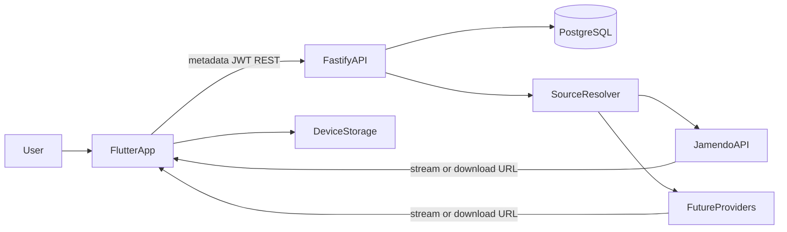
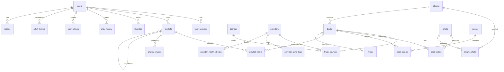

# Architecture

OpenTune is a production-oriented open-source music discovery and offline listening platform. It is a **mediator** between users and supported music providers. It stores **metadata**, not media.

This document is the source of truth for architecture. Implementation follows numbered phases. **Phase 20 (production deployment and open-source release) is complete.** Production runs API + PostgreSQL only — no object storage for audio. GitHub Releases attach no catalog media. See [docs/DEPLOY.md](docs/DEPLOY.md) and [docs/RELEASE.md](docs/RELEASE.md).

## Principles

1. Open source first (Apache-2.0 for application code).
2. No copyrighted music scraping.
3. Do not bypass DRM.
4. Do not download from providers that prohibit downloading.
5. Never convert streaming-only sources into downloadable files.
6. Store metadata, not audio/video.
7. Respect each source’s license and attribution requirements.
8. Every track has source and license information.
9. Offline playback happens entirely on the user’s device.
10. Playlists contain references to tracks, not copies of audio.
11. Sharing a playlist shares track/source metadata; the recipient resolves sources independently.
12. Providers are plugins/connectors, not hard-wired into the Flutter UI.
13. Offline-first behavior for poor connectivity.
14. The Flutter app is not coupled to a specific music provider.

## System context



**Hard rule:** there is no `Flutter → API → audio bytes` path. The API returns metadata and a resolved provider URL. The device fetches audio from that URL.

Infrastructure OpenTune **does not** operate:

- Audio/video object storage
- An audio CDN
- Transcoding workers
- A media proxy

Potential infrastructure: PostgreSQL, Node.js API, Redis only if later required, object storage/CDN only for application-owned assets (avatars), never for catalog audio.

## Repository layout

```
OpenTune/
  backend/          Fastify + TypeScript API
  mobile/           Flutter application
  ARCHITECTURE.md   this file
  API.md            versioned REST map
```

Backend and mobile are separate packages. Shared types can be extracted later if duplication becomes costly.

## Flutter architecture (from Phase 8)

Layers:

```
presentation → application → domain → data
```

Planned packages (now in `mobile/`):

| Concern | Package |
| --- | --- |
| State | Riverpod |
| Navigation | GoRouter |
| API HTTP | Dio |
| Local catalog / download index | JSON files in app documents (Drift can replace this later) |
| Secrets | flutter_secure_storage |
| Playback | just_audio + audio_session (queue, shuffle, repeat, seek; iOS `audio` background mode). Lock-screen / notification controls via `audio_service` are deferred so widget tests stay headless. |
| Downloads | Dio to app-documents from the **provider download URL** (cancel, checksum, license snapshot). `background_downloader` is deferred so widget tests stay headless. |

Primary navigation: Home, Discover, Library. A persistent mini-player sits above the bottom navigation while audio is playing. Home is artwork-first (daypart greeting, hero, horizontal shelves). Discover, track detail, and Library rows keep availability visible:

| State | Meaning |
| --- | --- |
| Available offline | File present on device |
| Download | Provider permits download |
| Stream | Stream permitted; download not offered |
| Attribution required | License requires credit |
| Download unavailable | Stream-only or provider forbids download |

## Provider connector architecture (Phases 5–6)

```
backend/src/providers/
  core/                 MusicProvider, capabilities, DTOs, errors
  jamendo/              first legal connector (Phase 6)
```

Conceptual interface:

- `search`
- `getTrack` / `getAlbum` / `getArtist`
- `getPlaylist` if the provider supports it
- `getPlaybackSource`
- `getDownloadSource`
- `getLicense`
- `getAttribution`
- `healthCheck`

Each connector **declares** capabilities. The core must not assume every provider supports every method.

```ts
type ProviderCapabilities = {
  supportsStreaming: boolean;
  supportsDownload: boolean;
  supportsOffline: boolean;
  supportsRedistribution: boolean;
  requiresAttribution: boolean;
};
```

The source resolver never invents a download from a stream-only capability set.

First planned connector: **Jamendo official API** (Creative Commons catalog, stream and download, attribution). Additional providers are additive plugins. Implemented in `backend/src/providers/jamendo/` with fixture tests; enabled when `JAMENDO_CLIENT_ID` is set.

## Source resolver (Phase 7)

```
Track → Source Resolver → Provider A / B / C → permitted available source
```

The resolver verifies:

- Source availability
- License
- Download permission vs streaming permission
- Provider capability flags
- URL validity
- Expiration when the provider issues time-limited URLs

Resolved playback/download URLs are **not** stored long-term in PostgreSQL if they expire. Persist provider id + external id + license + capability flags; resolve URLs at request time.

## Offline architecture (Phases 11–12)

Two catalogs:

| Catalog | Where | Contents |
| --- | --- | --- |
| Remote | PostgreSQL + provider APIs | Search, discovery, source resolution |
| Local | JSON download index + catalog cache on device | Downloaded files, metadata, artwork snapshots, last home payload |

Local download rows on device include: `remoteTrackId`, `localFilePath`, `downloadState`, `downloadProgress`, `fileSize`, `checksum`, `downloadedAt`, license snapshot. Files never leave the device. `background_downloader` can replace the Dio transport later without changing this model.

When offline, the app does not retry the API in a loop. It shows Offline mode, lists On this device, and the player refuses remote URLs unless a completed local file exists.

## Discovery ranking (Phase 16)

Ranking scores catalog **metadata**, never audio. Modes:

| Mode | Used for | Signals |
| --- | --- | --- |
| `catalog` | Search | Permitted download, streaming, open license, modest play count, recency |
| `forYou` | Home “For you” | Catalog signals plus artist/genre affinity from the listener’s plays and favorites |
| `trending` | Home / `/discovery/trending` | Play counts dominate |
| `fresh` | “New open releases” | Recency, then downloadable open tracks |

Paywalled and NC/ND catalogs never persist, so they never enter the ranker. Responses are the same track summaries as search (license + availability, no playback URLs).

## Provider health and sync (Phase 17)

Connectors implement `healthCheck()`. `GET /api/v1/providers/:slug/health` and `POST /api/v1/providers/health-sweep` both persist a `provider_health_checks` row and update `health_status` / `last_health_check_at`. After **three consecutive `down`** checks, `is_enabled` is set to false so search, resolve, and sync skip that connector. A later healthy check re-enables it.

`POST /api/v1/providers/:slug/sync` searches the connector and runs `persistProviderTrack` (titles, licenses, provenance). It does **not** call playback or download source methods and does **not** store audio URLs. Disabled providers return 409. Sync job rows are listed at `GET /api/v1/providers/:slug/sync-logs`.

The Flutter **Catalog sources** screen shows configured providers and health. It never triggers a stream or download.

## Security hardening (Phase 18)

- **SSRF:** `assertSafeProviderUrl` requires https, no userinfo, no IP/localhost, port 443, and an allowlisted hostname. Jamendo metadata `fetch` uses `redirect: "error"`. The API never accepts a user URL and retrieves it.
- **Operator routes:** `POST /providers/:slug/sync`, `POST /providers/health-sweep`, `GET /providers/:slug/health`, and `GET /providers/:slug/sync-logs` require header `x-opentune-operator` matching `OPERATOR_TOKEN` (timing-safe). `GET /providers` stays public metadata.
- **Share tokens:** 32 random bytes, `base64url`, stored as SHA-256. Lookup rejects short tokens.
- **Playlist ACL:** `private` and `unlisted` UUID GET is owner-only (404 otherwise). Recipients use `/playlists/shared/:token`. `public` is readable by id. Mutations always require ownership.
- **Reports:** authenticated `POST /api/v1/reports` against an existing entity. Reasons cannot be `http(s)` URLs. The API never fetches the reason text.

## Testing and performance (Phase 19)

Load tests concurrently call search and the source resolver. They assert metadata JSON only (no `/api/v1/audio`). Query indexes cover home (`tracks.deleted_at, created_at`), enabled providers, public playlists, recents, and trending play counts. Search is connector-based, so `pg_trgm` is unused. Details: [docs/PERFORMANCE.md](docs/PERFORMANCE.md).

## Production deployment and OSS release (Phase 20)

Production is **API + PostgreSQL**. There is no audio/video bucket. [`docker-compose.prod.yml`](docker-compose.prod.yml) does not publish Postgres. `NODE_ENV=production` rejects placeholder or identical JWT secrets. Pushing a `v*` tag builds the API image (no media layer) and opens a GitHub Release from `CHANGELOG.md` with no audio assets. [SECURITY.md](SECURITY.md) and [API.md](API.md) are the public contracts. Runbook: [docs/DEPLOY.md](docs/DEPLOY.md).

## Playlist sharing (Phase 14)

A playlist is metadata: title, owner, visibility, ordered **track references**. Sharing issues a hashed token (`POST /api/v1/playlists/:id/share`); the raw token is returned once with an app path `/playlists/shared/:token`. Recipients load metadata without auth, then resolve each track through the source resolver. Forking (`POST /api/v1/playlists/shared/:token/fork`) copies those references into the caller’s private library. Owners can revoke tokens (`DELETE /api/v1/playlists/:id/shares`). **Audio is never uploaded.**

## Data model (Phase 2)

Normalized relational schema. Soft-delete via `deleted_at` on `users`, `playlists`, and `tracks`. All tables have `created_at`; mutable tables have `updated_at`.



### Identity

**users** — `id` (uuid), `email` unique, `username` unique, `password_hash`, `display_name`, `avatar_url`, `bio`, timestamps, `deleted_at`.

**user_sessions** — hashed refresh token, `expires_at`, `revoked_at`, `user_agent`, `ip`, `user_id`. Access JWTs are short-lived; refresh tokens rotate (Phase 4).

### Catalog (metadata only)

**artists**, **albums**, **tracks** — titles, artwork URLs (provider-hosted or cached metadata URLs, not audio), duration, optional ISRC.

**track_artists** / **album_artists** — many-to-many with a `role` (`primary`, `featured`, …) and `position`.

**tracks.canonical_key** — unique-ish dedup key from normalized title + primary artist + duration bucket. Search aggregation (Phase 7) maps multiple provider hits onto one internal track when the key matches.

**genres**, **track_genres** — many-to-many.

### Provenance (required)

**licenses** — `spdx_id` unique (`CC0-1.0`, `CC-BY-4.0`, `CC-BY-SA-4.0`, …), human name, URL, flags: `allows_streaming`, `allows_download`, `requires_attribution`, `allows_redistribution`.

**providers** — `slug` unique (`jamendo`), display name, `is_enabled`, capability JSON, `base_url`, health fields.

**track_sources** — `track_id`, `provider_id`, `external_track_id`, `license_id`, `attribution_text`, capability flags, optional `checksum`, optional `url_expires_at` (informational). Unique `(provider_id, external_track_id)`.

Do **not** persist long-lived audio URLs.

### Social and library

**playlists** — owner, title, description, `visibility` (`private` | `unlisted` | `public`), optional `fork_of_playlist_id`, `deleted_at`.

**playlist_tracks** — `(playlist_id, position)` ordered refs; unique `(playlist_id, track_id)`.

**playlist_shares** — `token_hash` unique (raw token shown once), optional `expires_at`, `revoked_at`.

**favorites** — unique `(user_id, track_id)`.

**user_follows** — unique `(follower_id, followee_id)`.

**artist_follows** — unique `(user_id, artist_id)`.

**play_history** — `user_id`, `track_id`, `played_at`, `duration_played_ms`, optional `track_source_id`, optional context (`playlist` / `album` / `queue`).

**reports** — `reporter_id`, `entity_type`, `entity_id`, `reason`, `status`.

### Lyrics and ops

**lyrics** — only when a license allows storage/display; `track_id`, `license_id`, `text`, `is_synced`, `source`.

**provider_sync_logs** — job window, status, `records_synced`, error text.

**provider_health_checks** — timestamp, status, latency.

**user_download_intents** (optional, later) — server-side “this user wants this track offline” for multi-device sync. **Files stay on device.** Not implemented until a later phase needs it.

### Indexes and constraints (Phase 2, reviewed Phase 19)

- Primary keys: uuid, except join tables using composite keys
- Foreign keys with `on delete` appropriate to the relation (restrict catalog provenance; cascade join rows)
- Unique: `users.email`, `users.username`, `providers.slug`, `licenses.spdx_id`, `(provider_id, external_track_id)`, `playlist_shares.token_hash`, `(playlist_id, track_id)`, `(user_id, track_id)` on favorites
- Indexes: `play_history (user_id, played_at desc)`, `play_history (track_id)`, `playlist_tracks (playlist_id, position)`, `tracks.canonical_key`, `tracks (deleted_at, created_at desc)`, `track_sources.track_id`, `providers.is_enabled`, `playlists (visibility, deleted_at)`
- Search does **not** use `pg_trgm`. Connectors search; Postgres stores canonical keys. See [docs/PERFORMANCE.md](docs/PERFORMANCE.md).

### Migration strategy

- Prisma Migrate from Phase 2 (`backend/prisma/schema.prisma`, `backend/prisma/migrations/`)
- One numbered migration per schema change
- Seed: SPDX licenses (CC0-1.0, CC-BY-4.0, CC-BY-SA-4.0) and a **disabled** `jamendo` provider row (`npx prisma db seed`)
- Never store media in migrations or seeds

## API surface

Versioned REST under `/api/v1`. See [API.md](API.md). OpenAPI is served at `/docs` (Swagger UI) and `/docs/json`.

Phase 3 implements the API foundation. HTTP handlers remain health-only; other `/api/v1` resource modules are registered as empty routers for later phases:

- `GET /health`
- `GET /api/v1/health`
- Error envelope `{ "error": { "code", "message", "requestId" } }`
- In-memory rate limiting (health probes excluded)
- Request IDs via `x-request-id`

## Security

- Password hashing (argon2id) from Phase 4
- JWT access + hashed, rotating refresh tokens
- Rate limiting and Helmet (Phase 3)
- Zod validation on every request body/query
- Prisma parameterized queries
- Playlist ownership and share-token authorization
- Unlisted playlists are not readable by UUID except by the owner
- Operator token on catalog sync and health writes
- Provider host allowlists; no arbitrary URL fetch from the API
- Structured logging without secrets

## Development phases

| Phase | Focus |
| --- | --- |
| 1 | Architecture and repository setup |
| 2 | PostgreSQL schema and Prisma |
| 3 | API foundation (plugins, OpenAPI, errors) |
| 4 | Authentication and users |
| 5 | Music provider abstraction |
| 6 | Jamendo connector |
| 7 | Search and discovery APIs |
| 8 | Flutter foundation and design system |
| 9 | Home, Discover, Search UI |
| 10 | Music player |
| 11 | Offline download engine |
| 12 | Local-first library |
| 13 | Playlists and favorites |
| 14 | Playlist sharing and forking |
| 15 | Artist and album pages |
| 16 | Recommendation / discovery ranking |
| 17 | Provider health and synchronization |
| 18 | Security hardening |
| 19 | Testing and performance |
| 20 | Production deployment and open-source release |

Each phase must pass tests, static analysis, formatting, migration verification (when applicable), API checks, Flutter analyzer and tests, UI verification, and documentation updates **before** the next phase starts.
